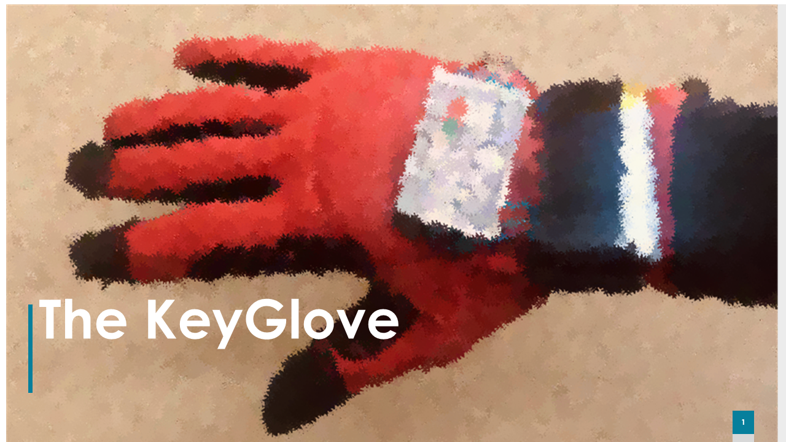

# The KeyGlove

<!-- PROJECT LOGO -->
 

  

<!-- TABLE OF CONTENTS -->
## Table of Contents

* [About the Project](#about-the-project)
  * [Built With](#built-with)
* [License](#license)
* [Contact](#contact)
* [Acknowledgements](#acknowledgements)

<!-- ABOUT THE PROJECT -->
## About The Project

The KeyGlove was developed to wirelessly control the keyboard and mouse of a computer by processing signals from the user's glove.

Current features include:

* Hand motion tracking
* English alphabet mapped onto five fingers,  
* Light and easy to wear
* It can replace a mouse, a joystick or a keyboard
* Different modalities are implemented

Please refer to the [.pptx](/The_KeyGlove.pptx) for an in-depth explanation of design/development.

### Built With
#### Software
* [Arduino](https://www.arduino.cc/)
* [Processing](https://processing.org/)
#### Hardware (links redirect to websites that ship the hardware)
* [FireBeetle esp32 x2](https://www.dfrobot.com/product-1590.html)
* [Flex sensors 2.2" x5](https://www.dfrobot.com/product-460.html)
* [Gyroscope MPU6050](https://www.amazon.com/HiLetgo-MPU-6050-Accelerometer-Gyroscope-Converter/dp/B01DK83ZYQ)
* PCB
* 22kΩ resistors x5
* LEDs x2
* 100Ω resistors x2

<!-- LICENSE -->
## License

Distributed under the MIT License. See `LICENSE` for more information.

<!-- ACKNOWLEDGEMENTS -->
## Acknowledgements
* [I2c Library](https://github.com/jrowberg/i2cdevlib/tree/master/Arduino/MPU6050)
* [README.md Template](https://github.com/othneildrew/Best-README-Template)

